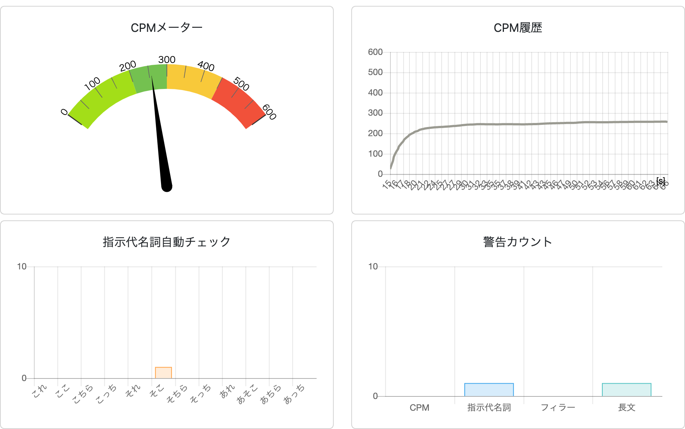
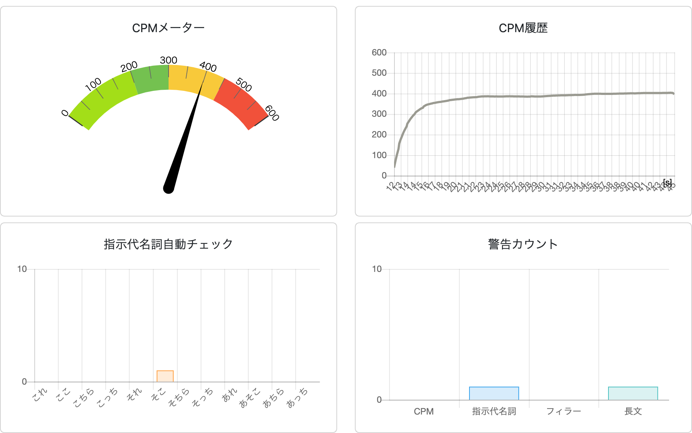

# 第19回情報処理学会アクセシビリティ研究会にて実施したベンチマーク

青空文庫の夏目漱石「坊っちゃんの」最初の1段落分、237文字に関してテストを行いました。人間による読み上げではなく、実験の利便性とデータの統一性から音声合成に音声認識をさせました。音声合成にはmacOSにて利用可能なsayコマンドを使いました。詳細は
  man say
にて各自ご参照ください。

音声には kyoko さん、-r オプションで読み上げ速度を測定しつつ、こちらが目指すCPMでの読み上げ音声ファイルを作成しました。-r オプション対応とCPMの対応（250,300,350,400）は論文で示した通りです。論文をご参照ください。

  * ベンチマーク用読み上げデータの原稿
    * [原稿データ:yomi01_237.txt](./yomi01_237.txt)
  * 250[CPM]読み上げ音声データ作成
    * say -r 133 -v kyoko -f yomi01_237.txt -o yomi01_237_250.aiff
  * 300[CPM]読み上げ音声データ作成
    * say -r 157 -v kyoko -f yomi01_237.txt -o yomi01_237_300.aiff
  * 350[CPM]読み上げ音声データ作成
    * say -r 186 -v kyoko -f yomi01_237.txt -o yomi01_237_350.aiff
  * 400[CPM]読み上げ音声データ作成
    * say -r 210 -v kyoko -f yomi01_237.txt -o yomi01_237_400.aiff

上記の通りで読み上げ音声データを作成し、作成した音声を[本システム](https://tetsuakibaba.jp/project/accessibleSpeech)に聞き取らせて結果を確認してください。PC内音声をアプリケーション内にて取り込むには loopback 等のソフトウェアもしくは、利用している音声ミキサーのLOOPBACK機能を用いると便利でしょう。

最後に，計測した結果画像を以下に貼り付けておきます．順番に250,300,350,400[CPM]をターゲットにしたものです．結構きれいにCPMが推定できている様子がわかります．

